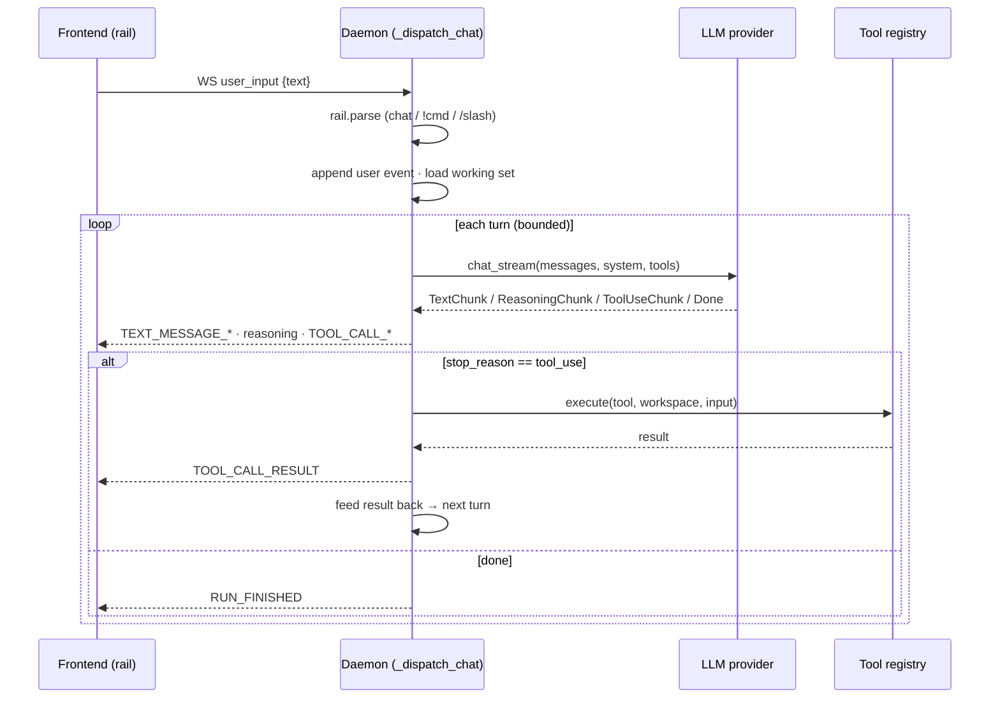
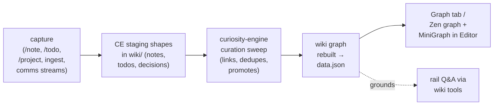

# Concepts & data flow

> **An agentic second brain you grow.** Feed it your notes, docs, and
> sources; capable agents curate them into expert knowledge graphs that
> compound — richer every session, owned and guided by you. **Route it.
> Grow it. Use it.**

How Switch Bay is put together, in one read. It defines the core
vocabulary (**Workspace → Thread → Run → Turn**), the runtime shape, and
the data flows behind the things you do most: chatting with an agent,
running tools, and turning raw material into a knowledge graph.

> If a detail here disagrees with the code, the code wins — this doc is
> the map, not the territory.

---

## The core loop

Everything serves one compounding loop:

```
  you bring raw material            AI helps you curate it
  (notes, docs, tasks,      ─────▶  into a private knowledge
   comms, projects)                 graph (wiki + vault + graph)
        ▲                                      │
        │                                      ▼
  the graph gets richer            you and agents work OVER
  and the next session      ◀─────  the graph (chat, tools,
  is smarter                        Auto orchestration, capture)
```

You **curate and direct**; agents do the legwork; the **knowledge graph**
is the shared substrate that compounds — every session leaves it richer,
so the next one starts smarter. It's **yours end-to-end**: one machine,
one user, your files on disk, and **any model you choose** doing the
work — a hosted API, a subscription coding CLI, or a model running fully
local. Nothing leaves unless you send it.

---

## Runtime shape

Two processes and your files. No cloud, no accounts.

```
 ┌─────────────────────────┐         ┌──────────────────────────────┐
 │  Browser frontend (PWA)  │  WS +   │   Python daemon (aiohttp)    │
 │  installed from          │◀──HTTP─▶│   always-on launchd agent    │
 │  http://127.0.0.1:8765   │  :8765  │   :8765                      │
 │  Power mode · Zen mode   │         │                              │
 └─────────────────────────┘         │  ┌────────────────────────┐  │
                                      │  │ LLM gateway (providers) │  │
   Your knowledge base                │  │  APIs: Anthropic · xAI  │  │
   (a "workspace"):                   │  │    · OpenAI · Gemini ·  │  │
     <ws>/wiki/     docs + graph      │  │    Meta                 │  │
     <ws>/vault/    raw sources       │  │  CLIs: Claude Code ·    │  │
     <ws>/.workbench/  config+state ◀─┼──┤    Grok Build · Muse ·  │  │
                                      │  │    Codex · Copilot      │  │
                                      │  │  local: llama.cpp/Ollama│  │
                                      │  │ tools · MCP bridge      │  │
                                      │  │ conversations.db (rail) │  │
                                      │  └────────────────────────┘  │
                                      └──────────────────────────────┘
```

- **Frontend**: a pure-browser PWA (no Electron/Tauri). Talks to the
  daemon over a WebSocket (live events) plus REST (`/api/*`). Installed
  from `http://127.0.0.1:8765` so it gets a dock icon + standalone
  window. In dev, vite serves `:5173` and proxies `/api` + `/ws`.
- **Daemon**: one aiohttp process, always on (launchd agent, restart on
  crash). Owns everything: the LLM providers, the tool registry, the
  rail history, the managed local model server, PTY sessions. Closing
  the window does **not** stop work — runs live in the daemon.
- **Knowledge base**: a **curiosity-engine**-shaped folder (curiosity-
  engine is bundled as a first-party skill). Durable, user-facing files
  (`wiki/`, `vault/`, figures,
  sketches, config) live in the workspace so they roam across machines;
  machine-local regenerable state (fan-out runs, caches) lives under the
  OS app-state root and never syncs.

---

## Vocabulary: Workspace → Thread → Run → Turn

The scope hierarchy, aligned to the AG-UI ecosystem:

| Concept | What it is | Lives as |
|---|---|---|
| **Workspace** | A knowledge base you work in — `wiki/` (docs + graph), `vault/` (raw sources), `.workbench/` (config + state). You register several and switch between them. | A folder on disk + a registry entry |
| **Thread** | The **switchable unit of work** — a durable, focusable conversation you return to. Has a `kind`. Tabs and terminals are *attached* to a thread, not part of it. | Rows in `conversations.db` (`conversation_id` **is** the thread id) |
| **Run** | One **dispatch** inside a thread — a single agent execution. Streams a lifecycle of events. Fan-out spawns child runs (`parent_run_id`). | A `run_id`; events tagged with it |
| **Turn** | One user↔assistant **exchange** inside a run: the model speaks + maybe calls tools, tools execute, results feed back, repeat until it stops (bounded by a turn cap). | Message/ToolCall primitives in the run stream |

**Thread kinds:**
- `structured-agent` — an AI agent conversation. Its run stream is
  AG-UI events; the rail renders a transcript (assistant text, tool
  cards, reasoning blocks, permission cards).
- `interactive-pty` — a real terminal (`bash`/`claude`/`tail -f …`) via
  `terminals.py`. The rail renders an xterm surface. Still emits AG-UI
  *lifecycle* events so the Agent Dashboard sees all threads uniformly.

---

## Three protocols (agent↔tool · agent↔frontend · agent↔agent)

Switch Bay adopts three open agent protocols, one per plane. It uses each
one's **stable core only** and keeps everything switchbay-specific in the
extension slots, so spec drift can't reach our surfaces.

**MCP (Model Context Protocol) — agent → tools.** How subprocess agents
reach Switch Bay's Python tools. The daemon runs an in-tree MCP server
(`switchbay.mcp_server`, stdio JSON-RPC, no wheel dependency); Claude
Code, Grok Build, and Codex are each pointed at it per-workspace, so the
same tool surface (`propose_*`, `create_report`, the wiki tools,
`save_skill`, …) works whoever is driving. Muse Code is **not** on that
bridge yet. You can also register **your own MCP servers** (Settings →
MCP servers, verified with a real `initialize` handshake at add time);
enabled ones are fanned into the CLI configs that support them, and
their tools card in the rail like any other.

Which provider is first-class vs preview (MCP, rail cards, live
validation) is in **[`providers.md`](providers.md)** — read that before
assuming every picker row is equivalent.

**AG-UI — agent → you (frontend).** Agent runs speak the AG-UI lifecycle
over the WebSocket: `RUN_STARTED` · `STEP_*` ·
`TEXT_MESSAGE_{START,CONTENT,END}` · `TOOL_CALL_{START,ARGS,END,RESULT}` ·
`RUN_FINISHED` / `RUN_ERROR`. Everything switchbay-specific rides on
AG-UI **`CUSTOM`** events — `hello`, workspace/thread focus,
`files_changed`, `artifact` (Zen pulse), `reasoning` (collapsible
chain-of-thought), permission cards, selection, pasteboard, slash results
— and the frontend unwraps `CUSTOM` at the socket boundary so each
handler sees the inner shape.

**A2A — agent → agent.** Threads can collaborate. The daemon serves an
Agent Card at `/.well-known/agent-card.json` and JSON-RPC `message/send`
/ `tasks/get` at `/a2a`, mapping A2A's `contextId` → thread, `Task` →
run, `Message` → a turn. The `list_threads` / `ask_thread` agent tools
use it to delegate to another thread — in this workspace or another
registered one (e.g. "ask the thread that already solved X"). Busy / PTY
threads refuse. `message/stream`, push, and multi-machine federation are
deferred until a real second consumer (an iPhone companion, a second
machine) exists.

The stack composes: MCP gives an agent its tools, AG-UI streams what it's
doing to you, A2A lets one agent hand work to another.

---

## Data flow 1 — a rail chat turn

You type in the rail; an agent answers, calling tools as it goes.



Key points:
- **Rail prefixes** route the input: *(none)* = chat · `!` = shell
  command (spawns an `interactive-pty` thread) · `/foo` = slash command
  · `!exc`/`!sql`/`!py` = interpreted.
- **Tools run in the daemon**, cwd = workspace, scoped to it. Subprocess
  providers can't call Switch Bay's Python tools directly. Claude Code,
  Grok Build, and Codex reach them through the **MCP bridge**
  (`switchbay.mcp_server`, stdio JSON-RPC), registered per-workspace.
  Muse Code cannot yet — see [`providers.md`](providers.md).
- **Provider-agnostic**: the same loop drives a hosted API (Anthropic,
  **xAI Grok**, OpenAI, Gemini, Meta), a subscription coding CLI (Claude Code,
  **Grok Build**, Muse Code, Codex, Copilot), or a fully-local llama.cpp/Ollama
  model — **your choice, your keys, your machine**. A per-rung **model
  ladder** mixes providers by difficulty: the lead/orchestrator model
  follows your picker, while worker and trivial tiers route to cheaper
  rungs, so one Auto orchestration or fan-out can span several providers.
  When only one provider is configured — GitHub Copilot in the enterprise
  profile is the usual case — independent workers use **different models
  from that provider's catalog** (for Copilot: GPT vs Claude vs Gemini vs
  o-series) rather than repeating the same id. The ladder and admin
  policy still decide what is allowed.
- **Local model harness**: for the local model only, a small, editable,
  self-tuning operating-rules block is appended to the system prompt and
  a loop-guard breaks repeated identical tool calls (Settings → Local
  agent model → *Model harness (advanced)*).

---

## Data flow 2 — capture → curation → graph (how knowledge compounds)

The graph isn't hand-built; it grows from what you capture.



- **Capture** writes curiosity-engine's own staging shapes; the CE
  sweeps *are* the async curation half. Ingesting a file (Browser `+`)
  dispatches a background agent that classifies it into CE types and
  records `extracted_from` provenance.
- **Curation** (curiosity-engine, a bundled first-party skill) links and
  promotes captured material into the wiki graph. A wiki write schedules
  a background graph rebuild → `data.json`.
- **Propose → review, never blind writes.** An agent doesn't edit the
  wiki directly — the rail's write tools (`propose_wiki_page` /
  `propose_page_edit`) **stage** a page. A stronger **reviewer model**
  then vets it (accuracy weighted hardest — the gate against a small
  model's confident hallucinations) and rules **accept · edit · reject**:
  a clean page files itself; a rejected one is dropped with the reason; a
  borderline one becomes an **accept/reject card** in the rail whose
  *View* opens the draft + the reviewer's annotations as a Report
  artifact. So a weak-but-cheap model can safely *do* curation while a
  strong model + you keep the graph honest. There is **no delete-page
  tool** — writes stage, they never destroy.
- **Grounding**: the rail answers "what do we know about X?" via
  read-only **wiki tools** (`search_wiki` / `read_wiki_page` /
  `list_wiki_pages` / `wiki_neighbors`) — provably-safe reads never
  interrupt you with a permission card.

---

## Data flow 3 — Auto orchestration (and fan-out)

The default for ordinary rail chat is **Auto orchestration**. You pick a
cost/performance preference (Economy → Balanced → Maximum). That app-wide
preference sets **utility weights** (how much extra expected quality is
worth in cost and latency). It does **not** set N. Switch Bay scores a small
set of candidate policies and runs the highest-utility one; N is an observed
output. Auto may legitimately choose **one agent**. Extra workers only
appear when their marginal utility is positive. This is not a swarm:
investigators do not chat with each other. Extra workers may run on
other keyed providers (a second evidence path); the rail announces
that probe and remembers outages so it does not keep retrying a
weekly-limited or down channel. Provider health is not mixed into
the policy bandit. Learned recipe weights (which DAG to buy for similar
tasks) and last-good provider roster are **per workspace** — one workspace
does not train another. The learner's quality proxy rewards
completed, source-diverse, verifier-supported work, wiki/report artifacts
that landed, and desk pages retrieved again later; it does not use Reviews
clicks. Reviews stays an undo backlog. Buckets already split research /
finance / code / science; Settings' **Reset learned policy** clears only the
focused vault's bandit statistics, not its desk artifacts. Roles stay
computational kinds (investigate / verify /
synthesize / execute), not a user-built standing org. Recurring Auto
prompts live in the **Schedules** tab (per workspace; the daemon
fires due items even when that vault is not focused). A desk may
keep `.orchestrator/APPROACH.md` as the overnight problem-solving
sequence.

```
  Auto policy
      │
      ├─ N=1 ── ordinary Run (_dispatch_chat)
      │
      └─ sparse DAG of ordinary Runs
            investigate…  (independent slices + distinct retrieval;
                           no planner LLM; read-only wiki/graph tools)
            execute?      (orthogonal; parallel with investigators)
                 │
            evidence blackboard  (typed claims + provenance; compact views)
                 │
              verify  (evidence, not consensus; fresh context)
                 │
            optional targeted expansion  (new model family / method)
                 │
            synthesize → rail reply + optional create_report
                 │
            propose_wiki_page → Reviews  (durable wiki; same CE path)
                 │
            .orchestrator/  (desk artifacts: watchlist, briefs, cache)
```

Each DAG node is a Switch Bay **Run** (`parent_run_id`, optional
`orchestration_id` / `node_id`). Historical Runs without those fields
stay valid. Child tools are a **narrower** subset of the parent
allowlist — investigators get read-only retrieval, never wiki writes or
shell. A single **execute** node may inherit `run_command` / SQL the
parent already has; it runs in parallel with investigators as an
independent measurement path, not a second chat.

Downstream nodes receive a **compact blackboard view** (claims,
evidence, verdicts), never worker transcripts. Reducers see only their
sibling pair. Verifiers see unclassified candidates, not prior
verdicts. The synthesizer sees one classified row per claim and keeps
minority / unsupported findings.

Auto decomposes with method-specific retrieval queries rather than a
planner LLM, so parallel workers do not inherit one correlated framing.
Explicit `n≥2` fan-out still uses the historical planner.

**Fan-out** (explicit `n≥2` on the wire, `/route`, saved route-skills)
is the compatibility strategy: planner → N independent workers → concat
merge. Same executor, same bounds. The primary UI is Auto + preference,
not a worker-count dial.

Intra-run coordination is the **evidence blackboard**, not a shared
chat and not a pile of sibling markdown. A workspace-local
**`.orchestrator/`** folder (like CE's `.curator/`) holds *desk*
artifacts across runs: optional `watchlist.csv`, dated unreviewed
`briefs/`, download `cache/`, last-run timestamps. Investigators may
*read* the watchlist as shared input; they do not write conclusions
there. The synthesizer may `propose_wiki_page` so verified findings
enter the knowledge graph through the existing Reviews path. When it
names concrete recommendations (tickers, people, trades), it must
also emit per-item analysis and evidence wiki pages and link them
from the report so a user can check for unsourced leaps.

Run checkpoints still live under the machine-local `runs/<orchestration_id>/`
directory (`plan.json`, `results.json`, `blackboard.json`, per-node artifacts). A
crash or daemon restart can **resume** the DAG and skip finished nodes;
a user cancel is stored as cancelled and is not auto-resumed. The parent
Run is the **chief of staff** and is **not** capped at 15 minutes: it
keeps spawning investigators / verifiers / synthesizers until the
synthesizer emits `OBJECTIVE_MET: yes`, marginal utility drops to zero
(idle stop), a wave produces no new evidence, or you kill the run. A
missing `OBJECTIVE_MET` line also stops safely instead of idling
indefinitely. Per-child workers still have a stuck timeout (~15 min).
If every usable provider is in cooldown (weekly limit, dead local server,
empty API credits) the chief **pauses**
(`waiting_limits`) and **auto-resumes** when a window reopens, unless
you cancelled. A local model server that is configured but down is
started only after an Approve card; spending BYOK API credits after
subscriptions are exhausted is the same kind of prompt, and credit
exhaustion is reported instead of retried.

Every node still emits AG-UI lifecycle events, so the **Agent Dashboard**
shows the graph: an agent-space projection of the live DAG, handoff
pulses, stages, models, verification conflicts, expansions, token cost.
Click the chief of staff for the team overview; click a worker for that
node's transcript. Handoffs are typed findings and compact views, not a
group chat.

### Vocabulary (orchestration)

| Concept | What it is |
|---|---|
| **Ordinary Run** | One agent execution inside a Thread. Auto's usual choice. |
| **Fan-out** | Explicit fixed parallelism (compatibility / advanced N). |
| **Auto orchestration** | Default adaptive sparse computation from task, evidence, resources, and the user's cost/performance preference. |
| **Evidence blackboard** | Transient orchestration-local claims + provenance. Not the wiki. |
| **Knowledge graph** | Durable accepted knowledge (`wiki/` + graph). Writes still go through propose → reviewer. |
| **A2A** | Agent/thread interoperability (`message/send`). Not the orchestration algorithm. |
| **Model ladder** | Available model/provider capability and cost hierarchy. The orchestrator may use it; it must not bypass it. |

---

## Data flow 4 — rich answers become artifacts (not chat walls)

When a question deserves a document — an analysis, a comparison, a
structured breakdown — a capable model doesn't dump it into the rail. It
calls the **`create_report`** tool with a self-contained HTML page; the
daemon renders it in a **Report tab** (a sandboxed `<iframe>`, no
external loads) and the chat reply shrinks to a **one-line summary +
link**.

```
  capable model → create_report(title, summary, html)
                       │
     saved to state ◀──┤──▶ Report tab (sandboxed iframe)
     (machine-local)   │        rail keeps a one-line summary
```

- **Gated to capable models** — the local model isn't offered the tool
  (it can't produce artifact-quality HTML); the ladder decides who
  qualifies.
- **Provider-uniform** — the tool runs in the daemon (hosted APIs) or in
  the MCP subprocess (Claude Code / Grok Build); either way the daemon
  scans for reports produced during the run and opens the tab, so the
  path is identical no matter who's driving.

---

## The two modes (same data, two cockpits)

Both modes render the same threads, runs, and graph — they differ in
layout.

- **Power mode** — the 3-column cockpit: **BROWSER** (left: pages, files,
  sources) · **TABS** (center, one visible: Graph · Editor · Table ·
  Sheet · Plot · Sketch · Library · Projects · Agents · Report · Intro ·
  Terminal + pack tabs) · **RAIL** (right: the agent conversation), with
  the Agent Dashboard as an overlay.
- **Zen mode** — think *at* the graph: the graph fills the left, a single
  surface (any non-graph tab) the right, and the conversation floats as a
  resizable box over both. One-click jumps from an agent's output to the
  exact artifact it produced.

Selection, the tab-swap button, and the multi-slot pasteboard are
cross-tab primitives (persisted under `.workbench/state/`) so a thing you
pick in one surface is actionable in another.

---

## Where state lives

| Kind | Location | Syncs? |
|---|---|---|
| Wiki docs, figures, sketches, plots, analyses, small config JSON | `<workspace>/.workbench/` (+ `wiki/`) | Yes — roams across machines |
| Rail history (`conversations.db`) | Machine-local by default (off cloud-sync — a live WAL DB corrupts there); Settings toggle to roam with the workspace | Default no |
| Fan-out / orchestration `runs/`, caches, the local model + its log | OS app-state root (`statedir.state_root()`) | Never |
| API keys | Daemon-owned (`~/.config/switchbay/secrets.json` 0600, or OS keychain) | Never |

Cloud-sync services dehydrate files; the daemon reads everything
off-thread and returns a "syncing…" state for evicted files so a placeholder
read can never wedge it.

---

## Portability & interop

Your knowledge is never locked in. A workspace is plain files — a
markdown `wiki/` with YAML frontmatter and a raw-source `vault/` — so the
graph is readable, diff-able, and git-able without Switch Bay running at
all. Two interop layers sit on top:

- **Live (agents):** the three protocols above — MCP, AG-UI, A2A — let
  external agents and clients drive and observe a running workspace.
- **At-rest (knowledge):** the curiosity-engine skill can project a wiki
  into an **OKF (Open Knowledge Format)** bundle — Google Cloud's draft
  interop format (v0.1, Apache-2.0) — via `okf_export.py`. Markdown stays
  the source of truth (the export is read-only and never mutates `wiki/`);
  CE-only structure that OKF has no home for round-trips through `x_ce_*`
  extension keys, so nothing is lost on the way out or back.

---

## See also

- `README.md` — what Switch Bay is and how to run it.
- `CLAUDE.md` — orientation for AI coding sessions.
- `src/switchbay/` — the daemon; each module's docstring carries its rationale.
